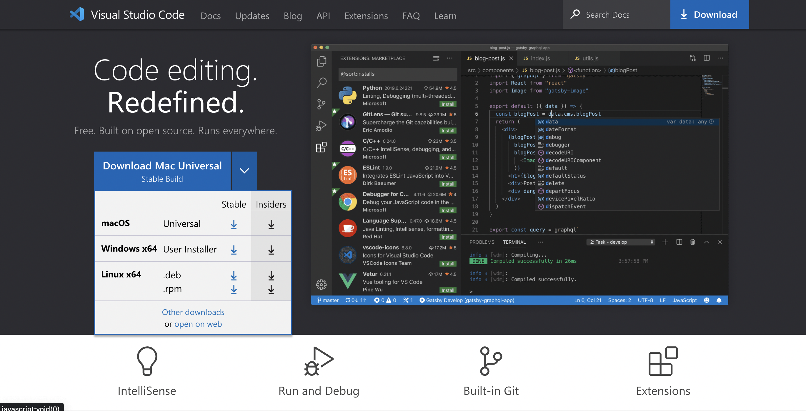
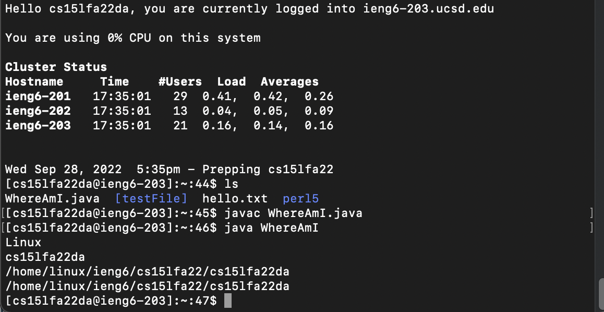
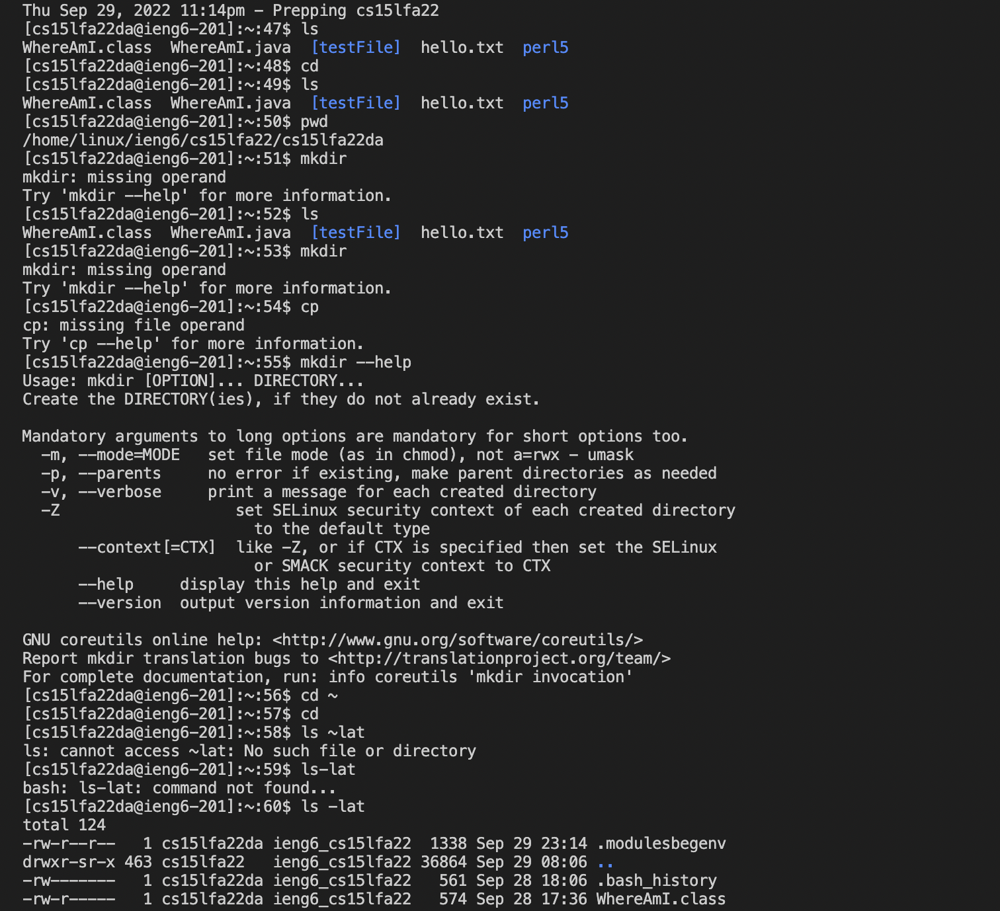
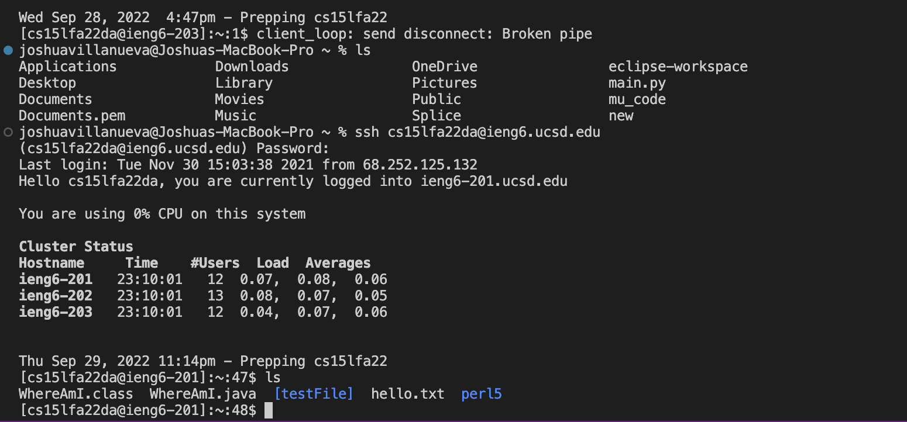
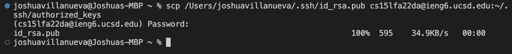
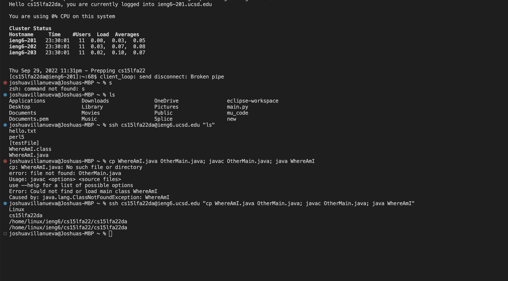

# Week 1 Lab Report: Remote Access

## Installing VScode

    I already had VScode installed on my computer. For anyone looking to install VScode, its as easy as going directly onto their website.
---
## Remotely Connecting

    All I had to do for this step was login by typing ssh cs15lfa22da@ieng6.ucsd.edu into the terminal and putting in my password. You will know that login was successful if you see a last login date/time and a confirmation that says “you are currently logged into ieng6”.
---
## Trying Some Commands

    I tried the LS, cd, PWD, MKDIR, and cp commands. PWD let me look a my current directory is helpful for finding where I am. The ls command showed me what is in my directory. I was able move to directories by using the cd command. Even more than that, all you have to do is type out “—help” after a command and it gives you a layout of what you can do with that command. I noticed immediately that by typing MKDIR I got an error and was easily helped by using “—help”.
---
## Moving Files with scp

  
    For copying using SCP I created a file on my computer named “WhereAmI.Java” with 
    class WhereAmI {
    public static void main(String[] args) {
        System.out.println(System.getProperty("os.name"));
        System.out.println(System.getProperty("user.name"));
        System.out.println(System.getProperty("user.home"));
        System.out.println(System.getProperty("user.dir"));
    }
    }

    inside of the file. Make sure to run Javac WhereAmI.java to make a class file and then you are able to run the file by typing in Java WhereAmI. Next, all you have to do is type “scp WhereAmI.java cs15lfa22da@ieng6.ucsd.edu:~/“ with the "da" part changed to your own and it will move the WhereAmI.java file to the remote computer. Remember you will have to enter your password when the terminal requests it, which will not show as a cursor movement in your terminal.   

---
## Setting an SSH Key

    First, make sure to create the pair of files to access the server with “ssh-keygen.” After, I designated where the keys would be stored on my remote computer(/Users/joshuavillanueva/.ssh/id_rsa). Lastly all I had to do is copy the key over to the server by logging into remote server, create a .ssh directory, logout, and use SCP to copy the file to .ssh on the server.

---
## Optimizing Remote Running

    Now that the SSH key is set, remote running is a lot easier. I was able to use quotes around my commands, such as “ls”, to run things from the remote server.
