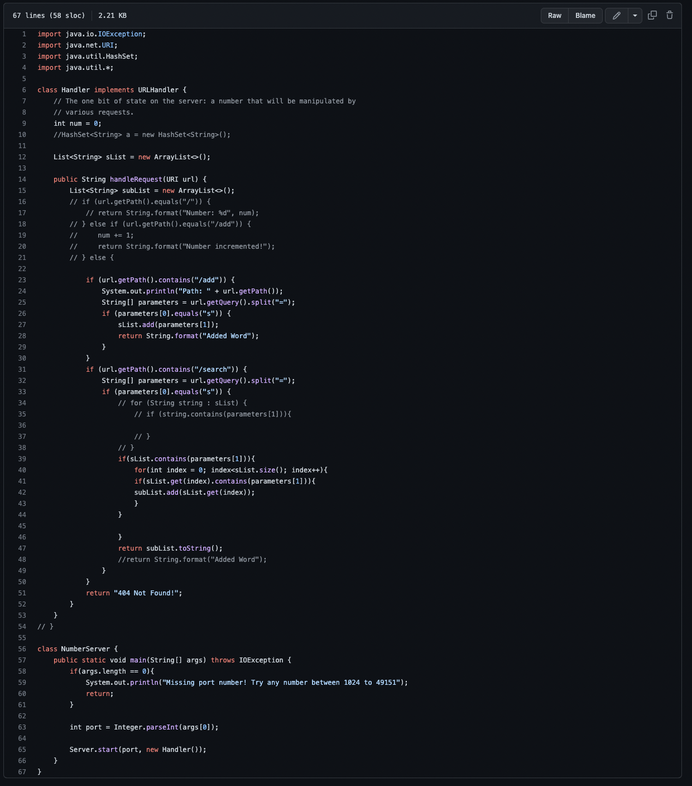
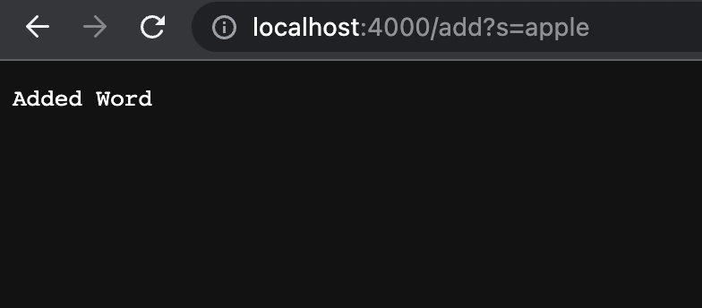
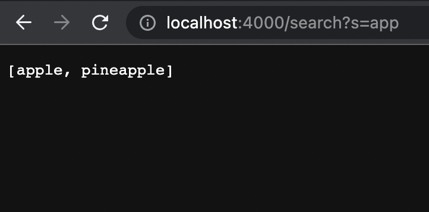
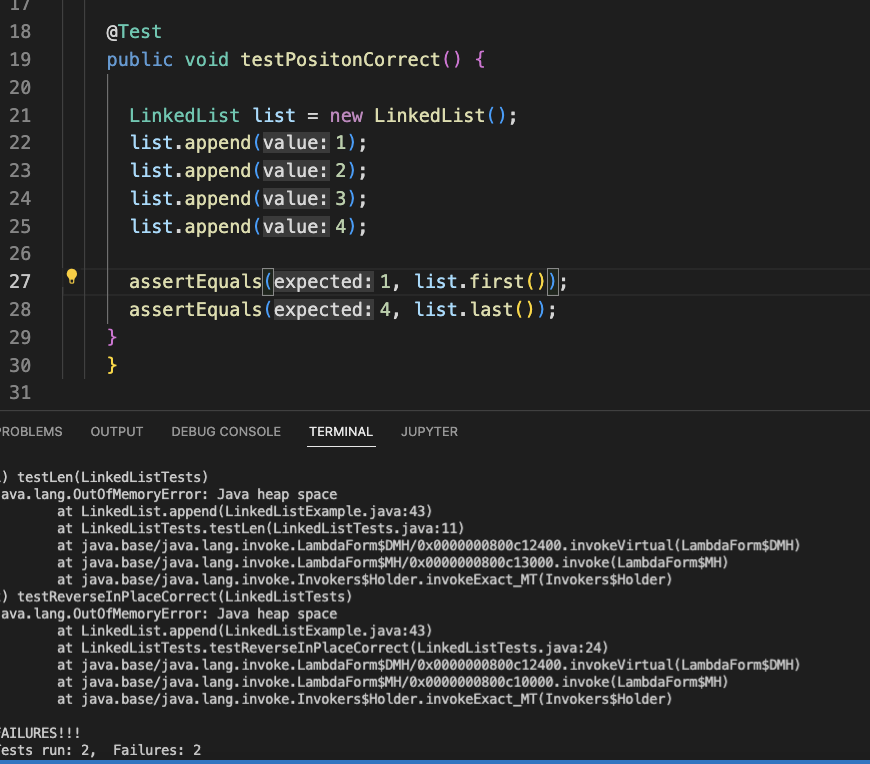

# Week 2 Lab Report: Servers & Bugs
### Search Engine

---
### Add

 *Which methods in your code are called:
 My handleRequest method is called to read through my URL and decide what action to take (if any). 
 *What the values of the relevant arguments to those methods are, and the values of any relevant fields(instance variable) of the class:
 My field is an arrayList called sList and my argument is the server URL which is an input of the handleRequest method. This parameter is read and based on that text after “/”, the  search engine acts accordingly. 
 *If those values change, how do they change by the time the request is done processing?
 
 Since “/add” is after the server name and port, my if statement adds the string listed after the “/add”. “apple” is then added to the array.

---
### Add

 *Which methods in your code are called
 My handleRequest method is called to read through my URL and decide what action to take (if any). 
 *What the values of the relevant arguments to those methods are, and the values of any relevant fields of the class
 My field is an arrayList called sList and my argument is the server URL which is an input of the handleRequest method. This parameter is read and based on that text after “/”, the search engine acts accordingly.
 *If those values change, how they change by the time the request is done processing
 Since “/add” is after the server name and port, my if statement adds the string listed after the “/add”. “pineapple” is then added to the array.

---
### URL in the browser and the response on the page:

 *Which methods in your code are called
 My handleRequest method is called to read through my URL and decide what action to take (if any). 
 *What the values of the relevant arguments to those methods are, and the values of any relevant fields of the class
 My field is an arrayList called sList and my argument is the server URL which is an input of the handleRequest method. This parameter is read and based on that text after “/”, the search engine acts accordingly.
 *If those values change, how do they change by the time the request is done processing
 None of the values change but they are instead read back to the user from the server. 

## Part 2
---
### LinkedListExamples.Java
 *The failure-inducing input (the code of the test)

 *The symptom (the failing test output) 
 After the test is run it is stopped because the heap ran out of memory due to the memory leak in the infinite loop.
 *The bug (the code fix needed)
 By iterating through the loop until the last node, then appending a new node outside the while loop the bug is fixed.

       while(n.next != null) {
           n = n.next;
       }
           n.next = new Node(value, null);
 
 *Then, explain the connection between the symptom and the bug. Why does the bug cause that particular symptom for that particular input?
 Line 41 is in an infinite while loop as it moves the pointer forward but never equals null therefore never flipping the bool in the while loop. The loop always appends a node in front of n which is why it never hits null. This results in a huge linked list until running out of memory.

 

---
## ArrayExamples.java
 *The failure-inducing input (the code of the test)

 *The symptom (the failing test output)  
 The array writes the reversed array into itself. 
 *The bug (the code fix needed)
Line 8 can be fixed by creating a new array and filling it with the reversed list.

 static void reverseInPlace(int[] arr) {
   int[] newArray = new int[arr.length];
   for(int i = 0; i < arr.length; i += 1) {
     newArray[i] = arr[arr.length - i - 1];
     arr = newArray;
   }
 }

 *Then, explain the connection between the symptom and the bug. Why does the bug cause that particular symptom for that particular input?
 Mid-way through the array, duplicate data will begin to be entered in the array because of the bug resulting in an inaccurate array list.