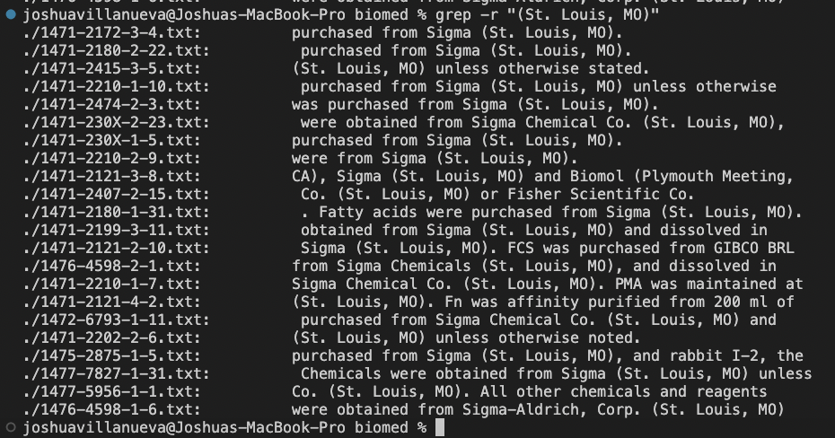
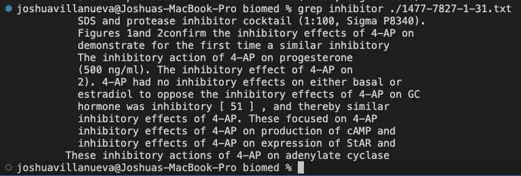
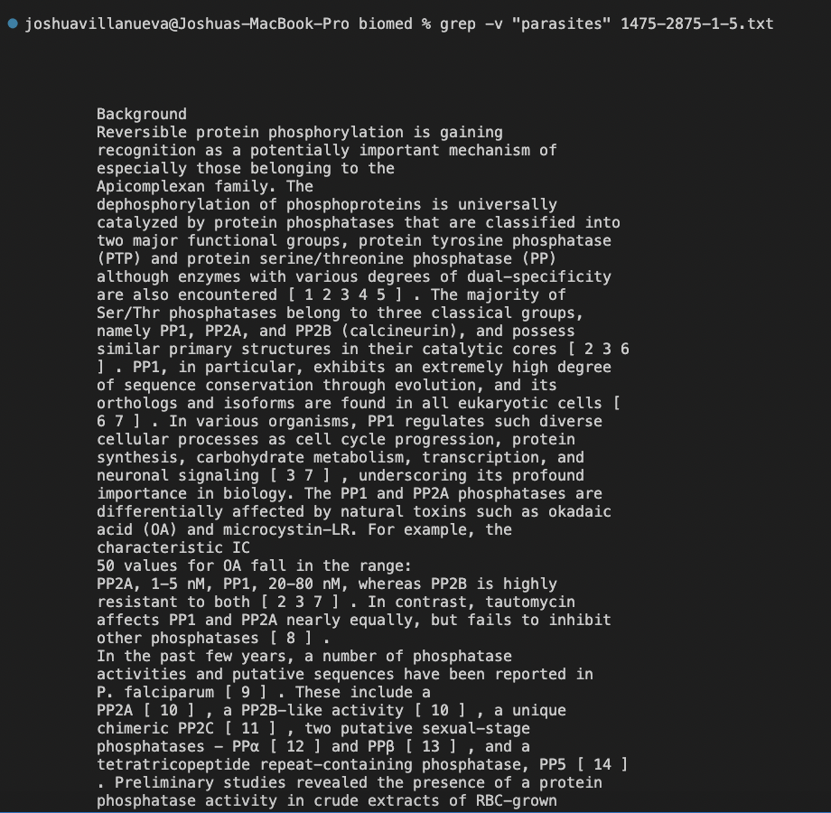
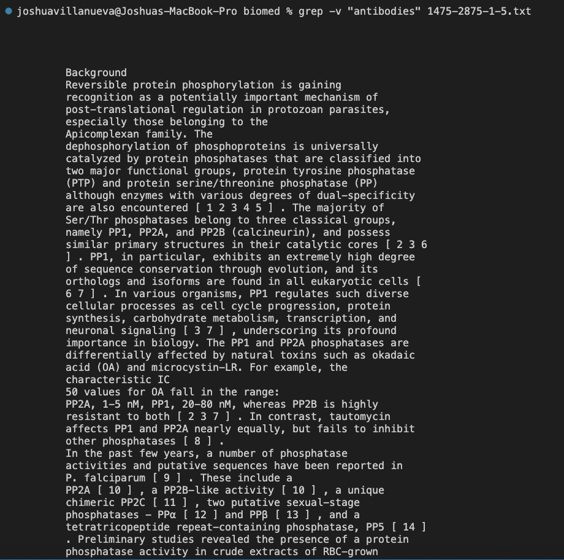

# Week 2 Lab Report: Servers & Bugs
# Command: grep
### Show each example as a code block that shows the command and its output, and write a sentence or two about what it’s doing and why it’s useful.

## grep -r EAI
 
  The grep -r command allows for a user to search for a string in a file recursively (through all files in the directory and all sub directories). This is a useful command if a user wants to search files related to a certain topic such as "EAI". 

---

## grep -r "(St. Louis, MO)"
 
   The grep -r command allows for a user to search for a string in a file recursively (through all files in the directory and all sub directories). This is a useful command if a user wants to search files involving specific locations such as "(St. Louis, MO)".
---

## grep -r "Membranes were stripped and"
 
   The grep -r command allows for a user to search for a string in a file recursively (through all files in the directory and all sub directories). This is a useful command if a user wants to search files involving specific phrases they remember but cant remember where from such as "Membranes were stripped and".
---

## grep Sigma ./1477-7827-1-31.txt
 
    The grep command allows for a user to search for the instances of a string on a line in a specific file. This is a useful command if a user wants to search for how many times a company is referenced and what that company was referenced for, such as "Sigma".
---

## grep inhibitor ./1477-7827-1-31.txt
 
     The grep command allows for a user to search for the instances of a string on a line in a specific file. This is a useful command if a user wants to search for how many times a certain affect showed up, such as "inhibitor".
---

## grep Chemicals ./1477-7827-1-31.txt
 
      The grep command allows for a user to search for the instances of a string on a line in a specific file. This is a useful command if a user wants to search for how many times a chemical reference showed up, such as searching for "Chemicals".
---

## grep -v "parasites" 1475-2875-1-5.txt
 
      The grep -v command allows for a user to inverse search for the instances of a string on a line in a specific file. This is the opposite of searchng for a term and the result only shows lines that do not contain the term. This is a useful command if a user wants to filter out a certain term unrelated to their research such as "parasites".
---

## grep -v "parasites" 1475-2875-1-5.txt 1471-213X-3-2.txt
 
       The grep -v command allows for a user to inverse search for the instances of a string on a line in a specific file. This is the opposite of searchng for a term and the result only shows lines that do not contain the term. In this example we are looking through 2 files. This is a useful command if a user wants to filter out a certain term unrelated to their research in multiple reports found, such as the term "parasites".
---

## grep -v "antibodies" 1475-2875-1-5.txt
 
       The grep -v command allows for a user to inverse search for the instances of a string on a line in a specific file. This is the opposite of searchng for a term and the result only shows lines that do not contain the term. This is a useful command if a user wants to filter out a certain term unrelated to their research such as "parasites".
---