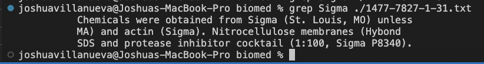

# Week 2 Lab Report: Servers & Bugs
# Command: grep

# grep -r EAI

--
# grep -r "(St. Louis, MO)"

# grep Chemicals ./1477-7827-1-31.txt

# grep Sigma ./1477-7827-1-31.txt

# grep inhibitor ./1477-7827-1-31.txt

# grep -v "antibodies" 1475-2875-1-5.txt

