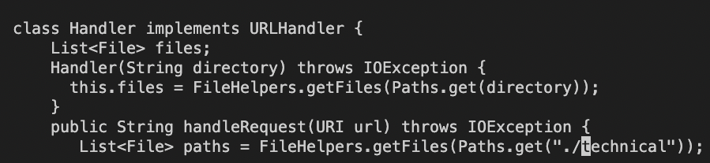
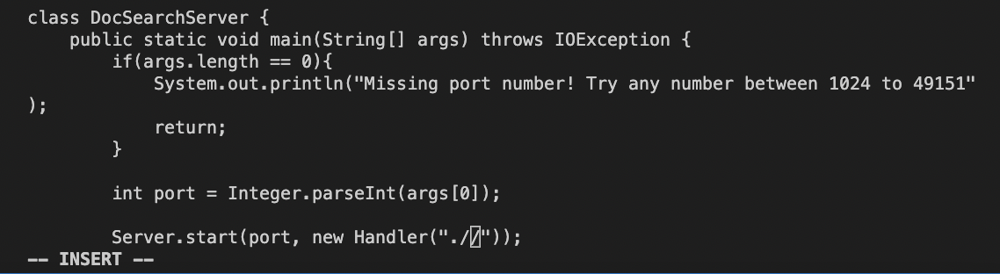
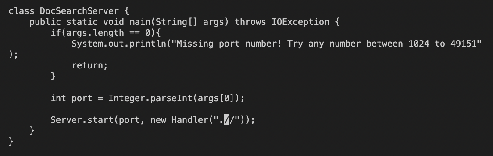
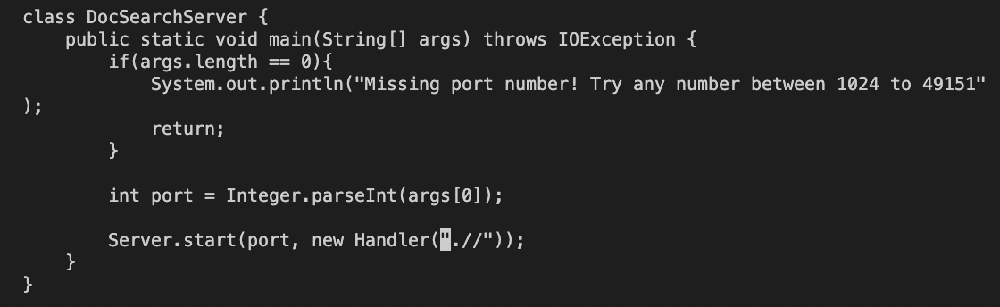
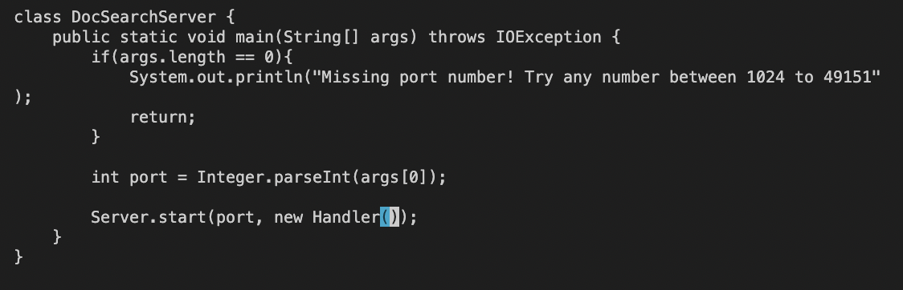
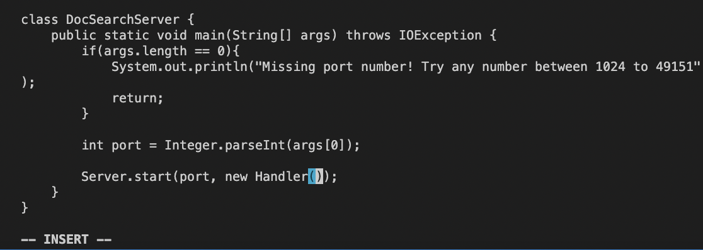
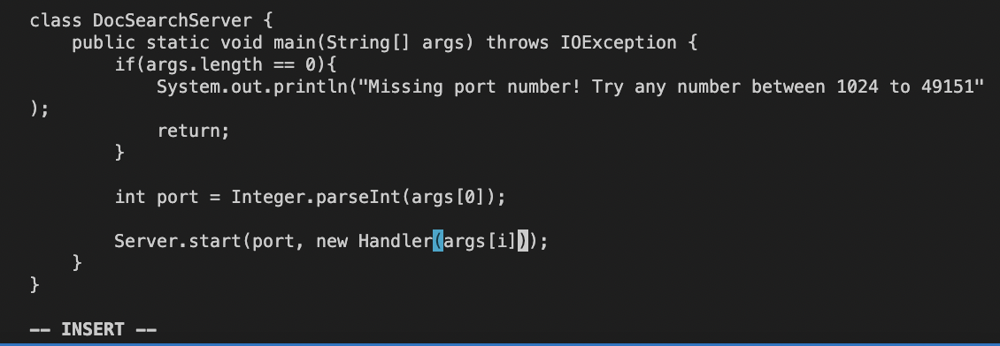
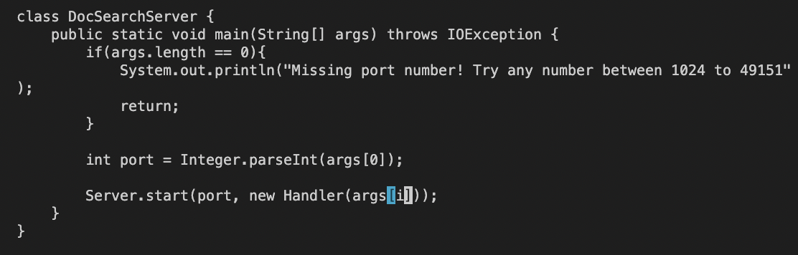
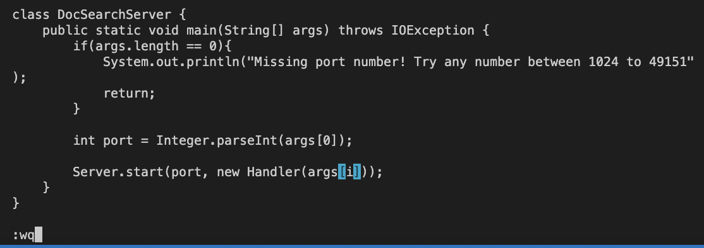

# Lab Report 4 - Vim
# Change main method to allow the second command line argument to be used for the path to search

 
* Open DocSearchServer in Vim

`vim DocSearchServer.java`

 
* Search for occurrences of /techn 

`/techn<Enter>`

 
* Iterate once to the second occcurence of techn

`n`

 
* Replace to the end of the current word with nothing

`ce`

 
* Exit insert mode

`<esc>`

 
* Move cursor left twice to the beginning of the parameter input

`h h`

 
* Delete everything in parameter input

`x x x x x`

 
* Change to insert mode

`i`

 
* Enter args[1] in the parameter space to allow for the use of the second command-line argument for the path to search

`args[1]`

 
* Exit insert mode and go back to normal mode

`<esc>`

 
* Save and quit vim

`:wq`