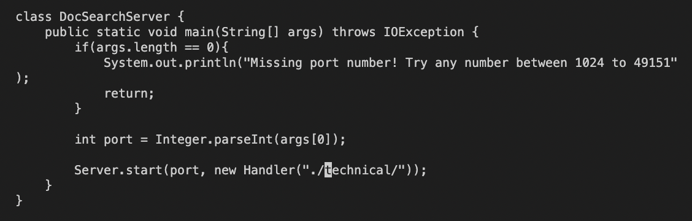

# Lab Report 4 - Vim
## Change main method to allow the second command line argument to be used for the path to search

Key Sequence to change main method:
`/techn<Enter>nce<esc>hhxxxxxiargs[1]<esc>:wq`

1. First use vim DocSearchServer.java in order to get into the DocSearchServer.java file.
2. After, type in each key sequence detailed below:

###    a. `/techn<Enter>` **searches for occurrences of /techn**

 

    - `n` **Iterate once to the second occcurence of techn**
 

 
* `ce` **Replace to the end of the current word with nothing**

 
* Exit insert mode

`<esc>`

 
* Move cursor left twice to the beginning of the parameter input

`h h`

 
* Delete everything in parameter input

`x x x x x`

 
* Change to insert mode

`i`

 
* Enter args[1] in the parameter space to allow for the use of the second command-line argument for the path to search

`args[1]`

 
* Exit insert mode and go back to normal mode

`<esc>`

 
* Save and quit vim

`:wq`