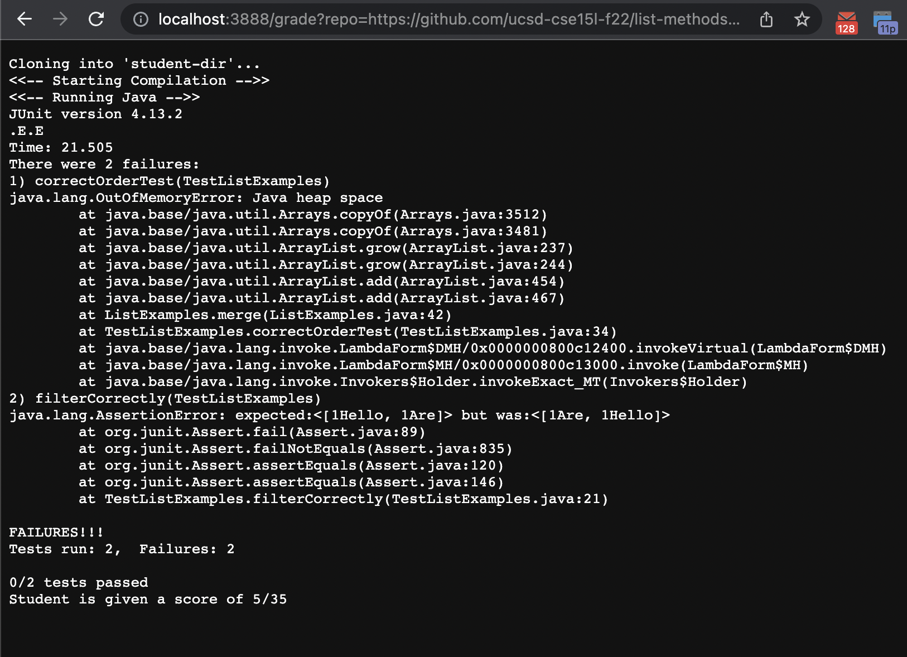
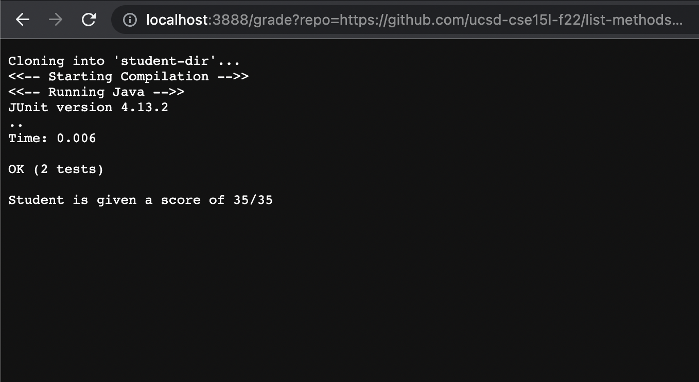
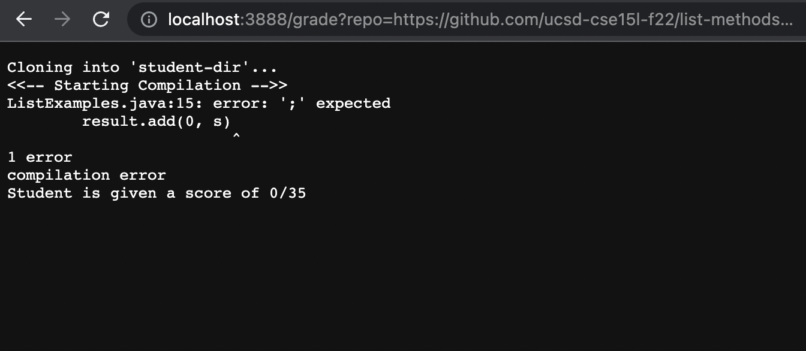

# Lab Report 5

### 1.Code Block

    #Total student score out of 35
    TOTAL_SCORE=0

    function score_message(){

	    printf "Student is given a score of $1/35 \n"
	    exit 0
}

    PREFIX=$PWD
    CP=".:$PREFIX/lib/hamcrest-core-1.3.jar:$PREFIX/lib/junit-4.13.2.jar" # relative junit
    TESTNAME="TestListExamples"
    STUDENT_DIR="student-dir"

    rm -rf $STUDENT_DIR 2> /dev/null

    git clone $1 $STUDENT_DIR || exit 1 # names the repo $STUDENT_DIR 

    set -o pipefail

    INNARDS=$(ls ./$STUDENT_DIR)
    # very bad case of a repo with just one subdirectory
    if [[ -d ./$STUDENT_DIR/$INNARDS ]]; then
	    STUDENT_DIR=$STUDENT_DIR/$INNARDS/
    fi

    cd ./$STUDENT_DIR/

    # wrong name fix, one file expected though
    #FIXME: I do not know how a file with multiple periods in filename may behave
    badname=$(ls | cut -d '.' -f 1)
    if [[ $badname.java != ListExamples.java ]]; then
	    sed -i "s/${badname}/ListExamples/g" $badname.java
	    mv $badname.java ListExamples.java > /dev/null
    fi

    cp $PREFIX/$TESTNAME.java ./

    printf "<<-- Starting Compilation -->>\n"

    javac -cp $CP *.java | tee output.txt

    # check if their code compiled without errors
    if [[ $? -ne 0 ]]; then
	
	    echo compilation error
	    score_message $TOTAL_SCORE

    fi

    # awarding them points for compiling
    TOTAL_SCORE=$((TOTAL_SCORE + 5))

    printf "<<-- Running Java -->>\n" 

    java -cp $CP org.junit.runner.JUnitCore $TESTNAME | tee -a output.txt

    # check if their code runs tests
    if [[ $? -eq 0 ]]; then
	
	    # awarding them full points
	    TOTAL_SCORE=$((TOTAL_SCORE + 30))
    else

	    t=$(grep -i "Tests run" output.txt)
	    tests=$(echo $t | cut -d ' ' -f 3 | cut -d ',' -f 1)
	    failed=$(echo $t | cut -d ' ' -f 5)

	    echo $((tests - failed))/$tests tests passed

	    TOTAL_SCORE=$((TOTAL_SCORE + 15*(tests - failed))) # 15 is just the point per test in this example
    fi

    # Give a final score for the students
    score_message $TOTAL_SCORE

### 2. Student Submissions

### - a. (list-methods-lab3)
 
### - b. (list-methods-corrected)
 
### - c. (list-methods-compile-error)
 

### 3. Trace Script (list-methods-corrected)

    function score_message(){
	    printf "Student is given a score of $1/35 \n"

Std.out: Student is given a score of 35/35 ; Std.err: None; Return Code: Zero

	    exit 0 
}

Std.out: None; Std.err: None; Return Code: Zero

    rm -rf $STUDENT_DIR 2> /dev/null 

Std.out: None; Std.err: None; Return Code: Zero

    git clone $1 $STUDENT_DIR || exit 1 # names the repo $STUDENT_DIR

Std.out: None; Std.err: None; Return Code: Zero

    set -o pipefail  

Std.out: None; Std.err: None; Return Code: Zero

    INNARDS=$(ls ./$STUDENT_DIR)
    # very bad case of a repo with just one subdirectory
    if [[ -d ./$STUDENT_DIR/$INNARDS ]]; then
	    STUDENT_DIR=$STUDENT_DIR/$INNARDS/
    fi

If statement does not run because it just checks if the a directory was put in a repo which isn't the case.

    cd ./$STUDENT_DIR/ 

Std.out: None; Std.err: None; Return Code: Zero

    # wrong name fix, one file expected though
    #FIXME: I do not know how a file with multiple periods in filename may behave
    badname=$(ls | cut -d '.' -f 1)  
    if [[ $badname.java != ListExamples.java ]]; then
	    sed -i "s/${badname}/ListExamples/g" $badname.java 
	    mv $badname.java ListExamples.java > /dev/null 
    fi

If statement does not run because the names are already correct and do not need to be corrected.

    cp $PREFIX/$TESTNAME.java ./  

Std.out: None; Std.err: None; Return Code: Zero

    printf "<<-- Starting Compilation -->>\n"

Std.out: <<-- Starting Compilation -->>\n; Std.err: None; Return Code: Zero

    javac -cp $CP *.java | tee output.txt

Std.out: None; Std.err: None; Return Code: Zero

    # check if their code compiled without errors
    if [[ $? -ne 0 ]]; then
	
	    echo compilation error 
	    score_message $TOTAL_SCORE 

    fi

The if statement does not run as the last exit code above was zero. -ne 0 is not equals to 0.

    # awarding them points for compiling
    TOTAL_SCORE=$((TOTAL_SCORE + 5))

    printf "<<-- Running Java -->>\n"

Std.out: <<-- Running Java -->>\n; Std.err: None; Return Code: Zero

    java -cp $CP org.junit.runner.JUnitCore $TESTNAME | tee -a output.txt

Std.out: None; Std.err: None; Return Code: Zero

    # check if their code runs tests
    if [[ $? -eq 0 ]]; then
	
	    # awarding them full points
	    TOTAL_SCORE=$((TOTAL_SCORE + 30))
    else

The if statement does run because the last return code above was 0 which makes the comparison 0 == 0 --> True

	    t=$(grep -i "Tests run" output.txt)
	    tests=$(echo $t | cut -d ' ' -f 3 | cut -d ',' -f 1)
	    failed=$(echo $t | cut -d ' ' -f 5)

	    echo $((tests - failed))/$tests tests passed 

Std.out: 2 tests passed; Std.err: None; Return Code: Zero

	    TOTAL_SCORE=$((TOTAL_SCORE + 15*(tests - failed))) # 15 is just the point per test in this example
    fi

    # Give a final score for the students
    score_message $TOTAL_SCORE 

Std.out: 35; Std.err: None; Return Code: Zero